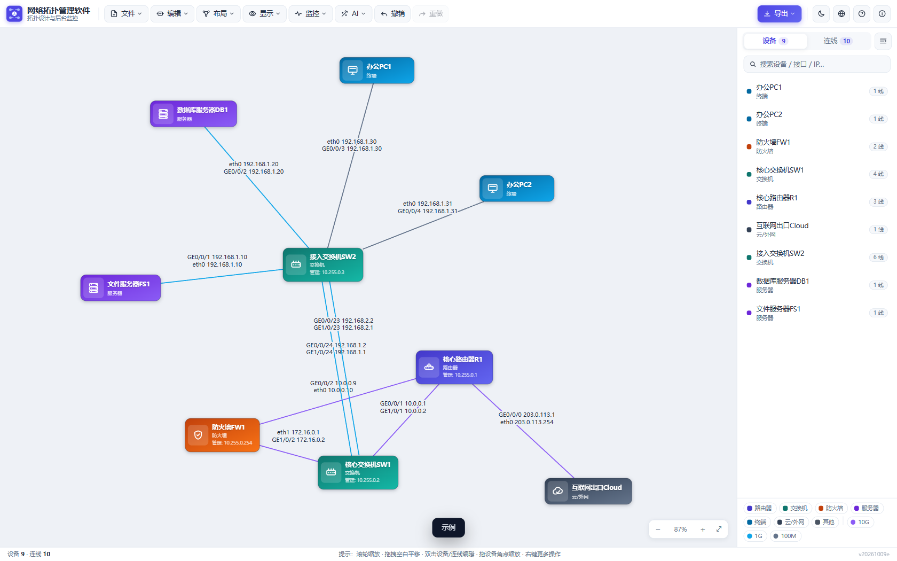
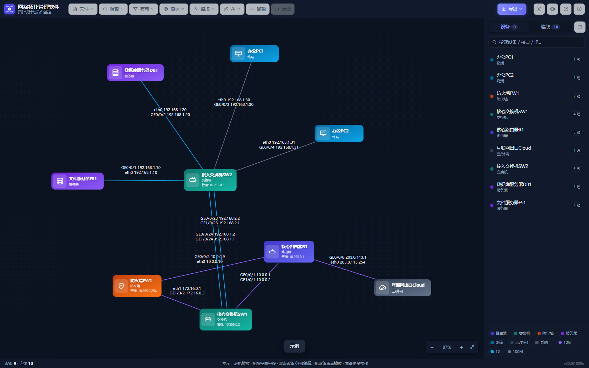
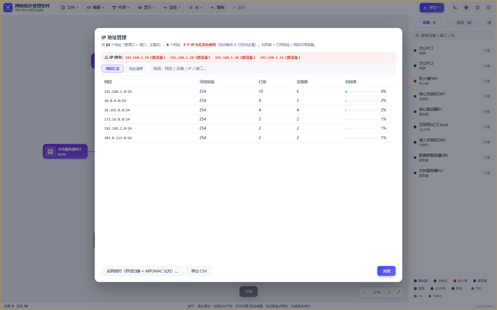
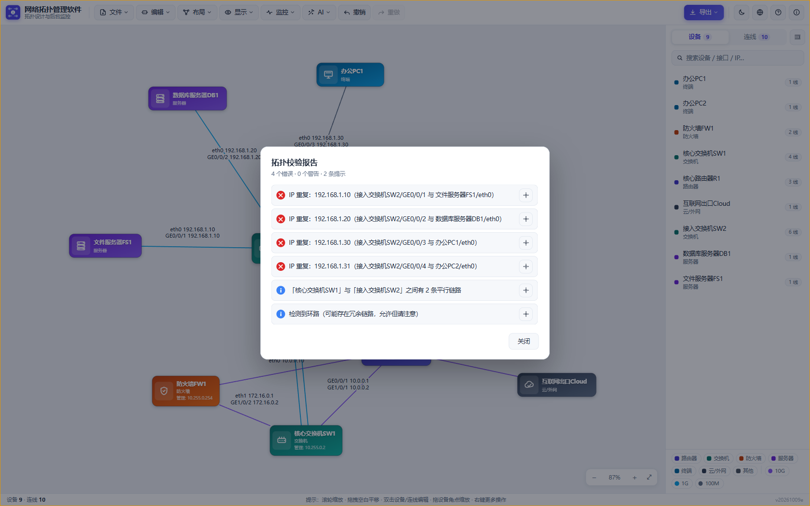
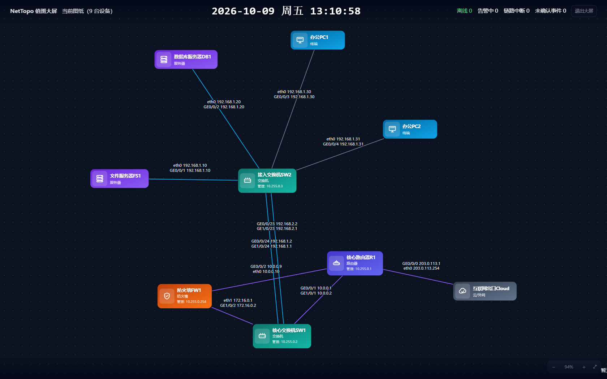
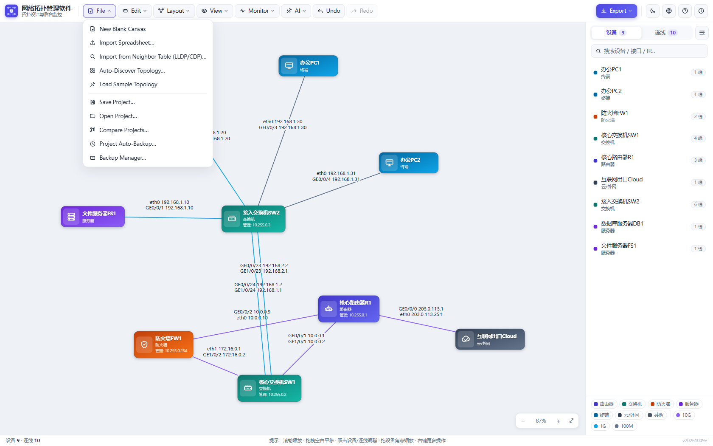
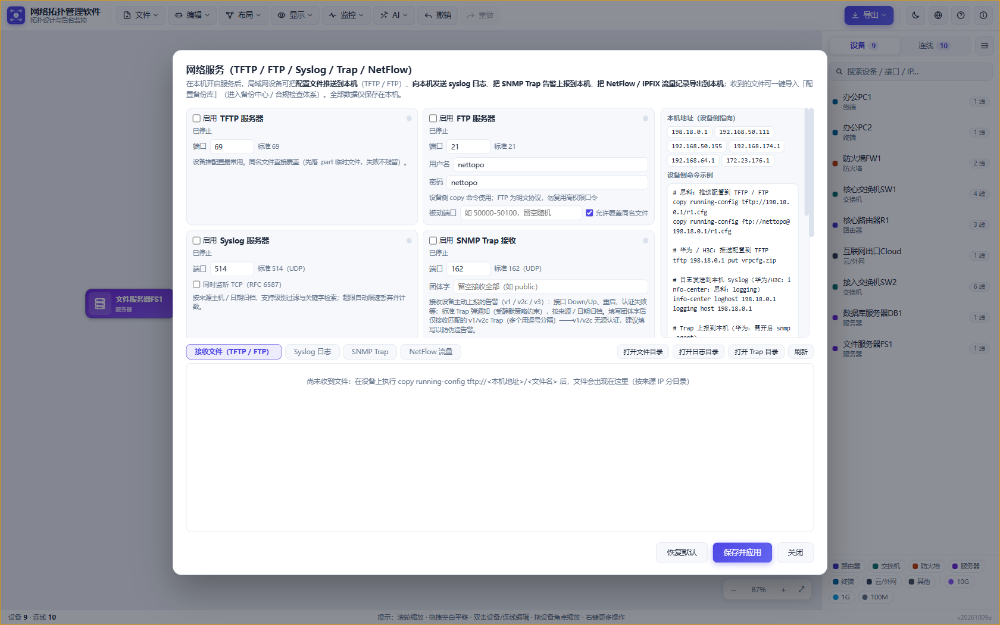
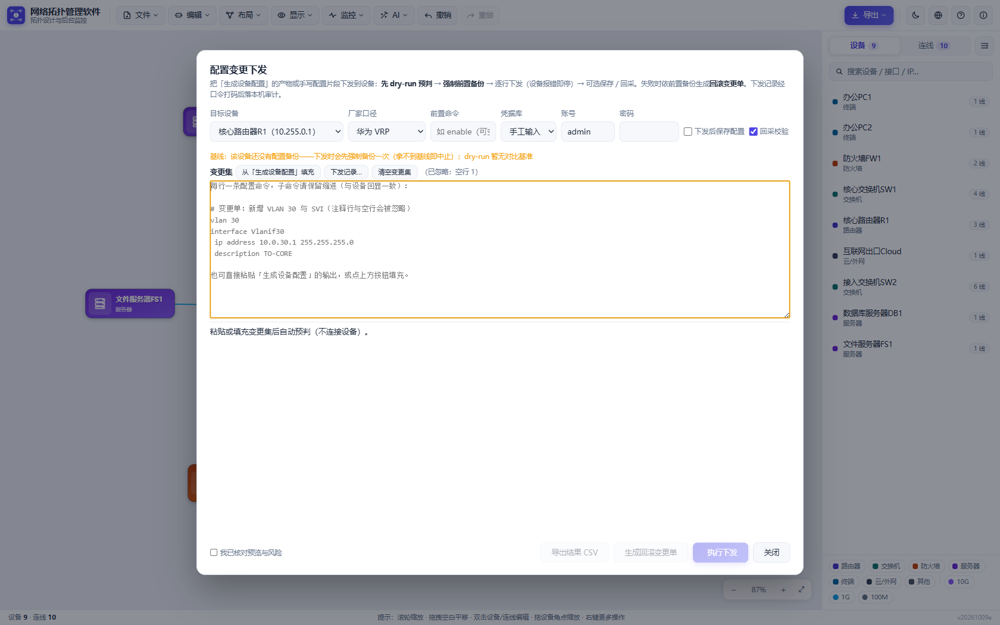

# NetTopo · Network Topology Design & Management Software

English | [简体中文](README.md)

> **Fully local · Zero install · Zero backend** — Generate topology from link spreadsheets or device neighbor tables in one click, edit and validate on canvas, deliver via PDF / image / Visio / Excel; the desktop edition further provides Web Shell, silent device monitoring, config backup with compliance baselines, an alerting system and AI analysis. **All data stays on your machine.**

    

Opening `index.html` in a browser also works (core features available; desktop-only capabilities degrade gracefully).

---

## Table of Contents

- [Feature Overview](#feature-overview)
- [Screenshots](#screenshots)
- [Feature List](#feature-list) (Canvas & Editing · Analysis & Validation · Import & Delivery · Monitoring & Ops (Desktop))
- [Getting Started](#getting-started)
- [Spreadsheet Format](#spreadsheet-format)
- [Operation Quick Reference](#operation-quick-reference)
- [Project Structure](#project-structure)
- [Development & Testing](#development--testing)
- [Data & Security Notes](#data--security-notes)
- [Online Upgrade](#online-upgrade)
- [License](#license)

---

## Feature Overview

| Category | Highlights |
| --- | --- |
| 🖼️ **Canvas & Editing** | Topology from CSV / Excel / neighbor tables in one click · Force-directed **zero-overlap** layout · Multi-sheet · Region grouping · Free node resizing · Orthogonal routing · Machine-room floor-plan underlay · Light/dark themes |
| 🔍 **Analysis & Validation** | Topology validation · Bandwidth-optimal path analysis · Subnet analysis · SPOF & blast-radius analysis · Interface table · Link aggregation · IPAM live-network audit |
| 📤 **Import & Delivery** | PDF / PNG / SVG / **Visio (VSDX)** / Excel · Interactive topology HTML · Asset inventory / IP plan / design report · Vendor config generation · Topology auto-discovery |
| 📡 **Monitoring & Ops** | Web Shell (SSH/Telnet multi-tab + SFTP + AI assistant) · Silent device monitoring (probes / keywords / SNMP / **environment sensors**) · Config backup / drift compare / **one-click restore** · Change deployment with rollback · Compliance baseline check |
| 🔔 **Alerting** | Alert dependency suppression · Silence / maintenance windows · Four-level graded sounds · **Alert webhook delivery (WeCom / DingTalk / Feishu)** · End-to-end link connectivity monitoring · Event acknowledgment · SLA report · **One-click inspection report** |
| 🧰 **Built-in Services & AI** | TFTP / FTP / Syslog / SNMP Trap servers · **NetFlow/IPFIX collector** · Diagnostics toolbox · Batch inspection · MAC/ARP endpoint locator · AI analysis & daily report |

---

## Screenshots

| | |
| --- | --- |
|  |  |
| *Main window · sample topology (light theme)* | *Main window · dark theme* |
|  |  |
| *IP address management (subnet summary · conflict detection · live audit)* | *Topology validation report (click to locate on canvas)* |
|  |  |
| *NOC dashboard mode (wall display)* | *English UI (one-click Language switch)* |
|  |  |
| *Network services (TFTP / FTP / Syslog / Trap / NetFlow)* | *Config change deployment (safety gates · dry-run · rollback)* |

---

## Feature List

### Canvas & Editing

- **Import to topology**: CSV / TXT / Excel link spreadsheets (auto-detect UTF-8 / GBK, Chinese or English headers), auto layout (force-directed + rectangle collision separation, **zero overlap**), interfaces and IPs annotated on links
- **Manual editing**: drag, add/remove devices & links, double-click to edit, undo/redo, light/dark themes; Ctrl-click / Shift-band multi-select with group move, batch delete and batch edit (devices and links)
- **Free node resizing**: select a device and drag the bottom-right handle to **resize its box** (Shift keeps ratio, clamped 40×24–2000); icons and text scale with the box; manual sizes persist with the project and are not overridden by auto-resize triggered by renames / mgmt-address changes; right-click "Reset to Auto Size" anytime (center preserved)
- **Layout presets**: ring / layered (by type) / three-tier / topological layering / grid one-click placement; **orthogonal (right-angle) routing** toggle (canvas and PDF/PNG export in sync; Visio export keeps straight lines for further editing)
- **Canvas quick search**: Ctrl+F opens a floating search box — instant search by device name / type / mgmt address / note / model / VLAN and link interface / IP / note, Enter / ↑ / ↓ to cycle matches (select + center view + gold pulse)
- **Region grouping containers**: draw background group frames (e.g. Core / DMZ / Room A); devices dragged inside belong to the region (geometric center test), moving a region moves its members; double-click to edit name / color / size; persists with project / sheet and carries into PDF / PNG / SVG / Visio exports
- **Multi-sheet**: multiple topology pages per project (split by machine room / floor), tab switch / rename / delete; independent view per page; background monitoring covers all sheets; legacy projects auto-migrate to a single sheet
- **Custom device types & templates**: built-in types + custom types with image upload (stored locally); "Edit Device" also accepts a per-device icon (11 built-in + uploaded) and a **config vendor**; router/switch/firewall templates included, one-click placement at canvas center
- **Device custom fields + rack U-slot view**:
  - "Edit ▾ Custom Fields…" adds your own device attributes (6 built-in: **Owner / Department / Asset Tag / Warranty Expiry / Rack / U-Slot**, editable, up to 24; definitions stored locally, **deleting a definition keeps values already filled on devices**); values are filled in "Edit Device", persist with project / sheet, and become extra columns in the **asset inventory export**
  - "Edit ▾ Rack View (U-Slots)…" groups devices by the "Rack" field into a **U-slot elevation** (rack height 12–47U; U-slots accept `12` or `12-14` spans, U1 at the bottom): see occupancy of multiple racks side by side; **overlapping** U-slots are flagged ⚠ (hover explains the conflict), devices missing rack/U-slot are listed as "Not racked"
  - Export an **occupancy CSV** (rack / U-slot / device / model / version / mgmt address / owner / asset tag) and a **vector elevation SVG** (multiple racks stitched into one image for delivery docs or printouts)
- **IP subnet calculator**: enter IP and mask (CIDR like /26, dotted, or wildcard; defaults to /24), instantly get network / broadcast / usable range / host count with address-type annotation (/31 per RFC 3021); one-click fill from a topology subnet
- **Fault simulation**: right-click a link and "Mark Link Faulted (Simulate Outage)" — path analysis automatically routes around it
- **Large-graph performance**: drag / zoom / wheel repaints merged per frame (multiple pointer events in one frame recompute once), link sub-elements, bandwidth colors and node positions are cached — large topologies (hundreds of nodes/links) drag without frame drops; project writes debounce at 400 ms (synced flush on close/refresh); auto-backup skips full-library serialization during idle cycles

### Analysis & Validation

- **Topology validation**: one-click checks for duplicate IPs, duplicate interfaces, orphan devices, loops, parallel links, cross-subnet issues, etc.; click report items to locate on canvas
- **Path analysis**: pick two devices — the widest path is chosen by bandwidth, highlighted with bottleneck bandwidth and traversed interfaces
- **Subnet analysis**: "Layout ▾ Subnet Analysis…" aggregates all interface IPs / L3 VLAN interfaces / mgmt addresses by CIDR subnet (mgmt addresses without mask group as /24): member devices and links, used/available addresses and utilization, VLANs, source mix; auto-detects **subnet overlap** (mask planning conflicts), **network/broadcast address misuse** and **overcapacity**; click a row to locate and gold-highlight all members; CSV export
- **SPOF & impact analysis**:
  - "Layout ▾ Single Point of Failure Analysis" finds single-point devices (whose failure partitions the network) and non-redundant critical links (parallel links / LAG members count as redundancy); click items to locate and red-highlight affected devices
  - Right-click device/link "Impact Analysis…" simulates any single failure: view the disconnected area (ties mark all parts red with no surviving main network), or highlight the shortest bypass when redundancy exists; already-faulted links are included in the computation
- **Interface table**: "Edit ▾ Interface Table…" concentrates both ends of every link into one filterable table (device/interface/IP/mask/VLAN/LAG/L2/peer/note); "Apply Changes" writes edits back in one undo step; CSV export
- **Link aggregation marking**: tag links with a LAG name (e.g. Eth-Trunk1 / Port-Channel1); parallel links between the same pair of devices with the same LAG name are treated as one aggregate — validation no longer flags parallel links, path analysis sums member bandwidth (member failure uses remaining capacity; all members down = link down), annotation carries the LAG name into PDF/PNG/VSDX exports; LAG round-trips through CSV/Excel import/export
- **IP address management / IPAM live audit**:
  - "Edit ▾ IP Address Management…" aggregates all mgmt and interface IPs by subnet (capacity, utilization, cross-device duplicate IPs; CSV export)
  - The panel's "**Live Audit**" ties three capabilities together: **planned inventory** (registered IPs) × **live reachability** (diagnostics toolbox subnet ICMP scan + local ARP MACs, optional PTR) × **device-side facts** (concurrent logins collect ARP / MAC address tables, read-only; ARP gives IP→MAC, the MAC table gives MAC→access port — only chained together do they locate a port)
  - Verdicts: **IP conflict/rogue** (one IP observed with multiple MACs — hard evidence, with each MAC's device & port), **planning conflict** (same IP registered on multiple devices), **unregistered live ("squatter")**, **registered but offline**, **registered & live**, plus per-subnet used/capacity/free and counts; filter, one-click locate on canvas, CSV export
  - Verdicts are deliberately falsifiable: the same MAC appearing on another device's port is normal forwarding and does **not** count as rogue
- **Compare projects**: "File ▾ Compare Projects…" diffs another project/spreadsheet against the current topology (added / removed / changed devices and links)

### Import & Delivery

- **Topology auto-discovery (recursive mapping)**:
  - "File ▾ Auto-Discover Topology…" logs into **seed devices**, reads LLDP/CDP neighbor tables, and recurses via neighbors' **mgmt addresses** N levels deep (default 2, 1–5) to map a whole network in one run
  - Seeds can be checked from existing devices with mgmt addresses or entered manually (`IP` or `IP name`); credentials prefer the device's monitoring config, then a **fallback credential pool** (one `user password` per line, up to 5, tried in order); the same session can run `show/display version` to **identify vendor & model**
  - The device table shows status/name/mgmt address/level/discovered-from/neighbor count/vendor+model; the link table shows both ends and interfaces — both exportable to CSV; "Merge into topology" reuses existing devices by **mgmt address first, name second** (same-name case-insensitive and domain suffixes treated as identical), backfills missing mgmt addresses and vendors, completes link interfaces, and is **idempotent on re-run**; check "Preview only" to generate results without touching the canvas
  - Identity normalization (the name key upgrades to an address key once an address is known — one device never counted twice), depth/device caps (60), self-loop removal, and no-link-for-missing-peer-interface are guaranteed by the `U.createDiscovery` pure-logic state machine (unit-tested); concurrency 1–4, stoppable anytime
- **Import from neighbor tables (LLDP/CDP)**: paste `display lldp neighbor` (Huawei/H3C; brief table, key-value blocks, "interface has N neighbor(s)" headers, H3C verbose) or `show cdp neighbors` (Cisco table / detail) / `show lldp neighbors` (Cisco standard table) output — parsed into "local interface ⇄ peer device ⇄ peer interface", preview then merge; same-name peers reuse canvas devices, new devices get inferred types, existing links backfill missing interfaces, re-import is idempotent; the desktop edition can **collect from devices**: auto-login (SSH/Telnet) runs vendor presets (auto / Huawei / H3C / Cisco / Ruijie) and parses the output; first SSH connections trust the host fingerprint (TOFU), pagination prompts auto-space, Telnet auto-answers login; purely local parsing
- **Save back to spreadsheet**: export the edited topology as CSV / Excel link tables (multi-mgmt, VLAN, LAG columns; re-importable)
- **PDF / image export**: vector PDF for high-fidelity delivery; hi-res PNG / vector SVG; one-click copy to clipboard for chats/docs
- **Visio export**: generates `.vsdx` (Visio 2013+ native) editable in Visio; custom type images embedded; links are 2-D lines (endpoints pinned to device borders, manually adjustable)
- **Interactive topology HTML**: "Export ▾ Export Interactive Topology HTML" produces a **self-contained single file**: embedded SVG; click devices for details (type / mgmt / model / software version / interfaces & peers / notes / **monitoring status** with status dots — green up, red down), click links for interface / bandwidth / notes. No external links, no CDN, no eval — **recipients just double-click; no install needed** (inferred L2 links render dashed, consistent with canvas); all text is escaped before export so names/notes containing tags never become executable
- **Asset inventory / IP plan / design report**: asset inventory (Excel) summarizes name/type/mgmt/model/version/monitoring status/backup overview; the IP plan lists all mgmt and interface IPs per device (merged rows, peer info and subnet); the design report is a self-contained HTML (device/IP/subnet/link/bandwidth summary)
- **Device config generation**: generates Huawei / H3C / Cisco / Ruijie and custom-template config snippets from topology interfaces/IPs (static routes auto-derived, access VLANs), with per-device selection and per-device vendor override; automatic **conflict check** before generation; ZIP download grouped by vendor; mask variables in three forms: `{mask}` (255.255.255.0) / `{maskCidr}` (/24) / `{wildcard}` (0.0.0.255)
- **Project file**: save / open `.nettopo` (positions, zoom, multi-sheet, custom types, monitoring config) with optional **passphrase encryption** (PBKDF2-SHA256 + AES-GCM)

### Monitoring & Ops (Desktop)

- **Web Shell**: right-click a device to open SSH/Telnet to its mgmt address in an independent multi-tab window; the main window stays free
  - **Connection & auth**: SSH password / public key; via SSH jump host (bastion) with separate fingerprints for jump/target; output encoding selectable (UTF-8 / GBK for CJK on legacy devices); after disconnect a "Reconnect" banner appears **rebuilding the same tab in place** (no new tab, terminal history kept)
  - **SFTP file panel** (top bar "⇅ Files"): browse the remote directory of the current SSH session — upload / download / mkdir / rename / delete (double-click downloads; Telnet sessions not supported)
  - **Connection bookmarks** (top bar "☆ Bookmarks"): save frequent connections (protocol/address/account/encoding; optional DPAPI-encrypted passwords), double-click to connect; **tab restore**: reopening the window re-connects the last tab list staggered (DPAPI ciphertext re-registered per connection; explicitly closed tabs not restored)
  - **Terminal tools**: in-terminal search (Ctrl+F, all matches highlighted + count); quick command palette (Ctrl+P, fuzzy search across quick buttons / bookmarks / history, frequency-ranked); bottom **quick button bar** (SecureCRT style, supports \n Enter, \t Tab, \p pause); top bar "⇉ Broadcast" sends commands to multiple tabs and can **diff** tab outputs with differing lines highlighted
  - **AI assistant** (top bar "✦"): natural-language to terminal commands with a **device-type dropdown** injecting prompts (auto / Huawei VRP / H3C Comware / Cisco IOS / Juniper Junos / Linux shell / Windows cmd); **execution modes** (confirm-before-run — default / fill-only / run directly), **output types** (single commands / config block), optional recent terminal output as context, stoppable mid-generation
  - **Record / replay**: top bar "⏺ Record / ▶ Replay" captures terminal output into JSONL sessions and replays read-only at 0.5–8×; session content is also written to the local audit log, browsable and searchable in "Monitor Logs…"
- **Unified credential vault**: "Monitor ▾ Credential Vault…" centralizes device credentials — name, username, password / private key, protocol & port, **vendor match**, **pre-command** (e.g. Cisco user-mode `enable`), notes, default flag, up to 50 entries
  - All collection/deployment panels (neighbor collection / MAC·ARP locator / batch inspection / L3 neighbors / IPAM live audit / auto-discovery / config deployment) upgraded from "fallback account" to **vault dropdown + manual fallback**: only the entry ID goes to the main process — **username, password and pre-command are injected inside the session pipe in the main process, plaintext never passes through the renderer**
  - Auto-discovery matches vault entries by vendor command set (explicit selection → vendor match → default fallback; it does **not** brute-force the whole vault against a device — that locks accounts)
  - Passwords are encrypted by the OS (Windows DPAPI) into `userData/credentials/credentials.json`: when encryption is unavailable the store **refuses to save and says so** (never falls back to plaintext); a corrupted file enters read-only protection without overwriting
- **Device management web pages**: configure a "Management Web URL" and right-click to open in an independent multi-tab window; HTTPS self-signed certs raise a security warning (confirmable, rememberable); standard Chrome UA, popups become tabs, zoom remembered per page
- **Silent background monitoring**: right-click a device to configure SSH/Telnet accounts and commands; the background collects output into local daily-archived logs; per management address:
  - **On-connect commands** (once per connection), **liveness probe** (TCP/ICMP, offline notification), **output keyword alerts** (all keywords must match to raise, all must clear to resolve; events carry the matching lines)
  - **Automatic config backup** (reuse monitoring connection / separate connection, optional auto-compliance), **SNMP identification** (sysDescr backfills software version), **restart detection** (sysUpTime drop)
  - **CPU/memory collection** (configurable OIDs, vendor presets one click, GET falls back to GETNEXT), **interface traffic** (ifTable per-interface up/down and rates, 64-bit counters preferred), **interface error monitoring** (ifInErrors/ifOutErrors rates — optical aging and cable issues are invisible in traffic rates; error rate is the only early signal; threshold crossings recorded along the change and notified, historical errors don't alert; the Monitor Center "Interfaces" page pins non-zero error interfaces in red)
  - **Environment sensing**: standard mode uses **ENTITY-SENSOR-MIB (RFC 3433)** — one walk returns temperature / fan / power sensors (4-column table, scale/precision converted); unsupported devices use custom single-OID mode. Temperature warn/crit thresholds and fan-speed floor alerts enter the timeline with notifications; trends on the Monitor Center "Performance" page
  - **Disk/memory metrics (SSH)**: reuses the monitoring session to run df/free/loadavg on interval and parse values, "Linux server preset" one click, warn/crit dual thresholds into timeline + notification (skipped in read-only mode)
  - **HTTP probe / certificate expiry**: probes HTTP(S) from this machine on interval (2xx/3xx with optional keyword, down/up notifications); HTTPS also reads certificate days-remaining — alerts under threshold, auto-clears on renewal
  - **Lightweight modes**: read-only (no periodic commands, everything else intact) / probe-only (no commands, liveness only); Telnet monitoring auto-answers `Username:`/`Password:` prompts when a password is configured (auth failures reported in the status bar; interactive Web Shell logins unaffected)
- **Vendor SNMP presets**: the "Device Monitoring" dialog one-click applies CPU & memory OIDs per vendor (Huawei VRP/CE, H3C Comware, Cisco IOS/IOS-XE, Linux net-snmp/UCD, Juniper, FortiGate) with the vendor's **value semantics** (direct percent / 100−idle / used+free / total−free) — vendors disagree here, this normalizes it; when SNMP identifies the vendor (sysObjectID enterprise number first, sysDescr keywords fallback) the dialog pre-fills empty OIDs; other vendors (Ruijie/ZTE/Arista/HPE/Extreme/Palo Alto/MikroTik/F5…) recognized by enterprise number with manual OIDs. Huawei, Cisco and Linux UCD presets verified against real FRR lab devices
- **Monitor Center**: aggregates all monitoring status and a **7-day uptime** (10-minute buckets, survives restarts), five tabs:
  - **Event timeline**: events carry device badges; click a device name or address to filter; unacknowledged events show an orange bar + count badge; "Acknowledge" accepts a note (shift handover) and can be undone
  - **Config backups / Interfaces / Performance / Links**: CPU/memory/temperature trends and uptime; SSH metrics page shows per-mount disk / memory / load trends; HTTP probe status and certificate days; the Links tab shows per-segment results and break points; error column pins non-zero interfaces in red
  - **Interface traffic period report**: the Interfaces page "Traffic Report…" aggregates per-interface averages / peaks and uptime over a window (1h / 24h / 7d), TopN by peak, CSV export (averages count only valid rate samples — the first sample has no delta and counts as neither zero nor data)
  - "Export Inspection Data" exports all devices' SSH metric samples and HTTP/certificate history to CSV; "Monitor Logs…" supports global cross-file search with click-to-line
- **One-click inspection report**: "Monitor ▾ Inspection Report (One-Click)…" summarizes topology overview, device monitoring status (incl. temperature), 7-day availability, config backup overview, rack occupancy and recent events into a **self-contained, printable HTML report** — preview, system print (save as PDF) or download; all data is local, nothing sent anywhere (browser mode keeps the topology overview with monitoring sections degraded)
- **Floor plan underlay**: "View ▾ Floor Plan Underlay…" places a machine-room/floor image (PNG / JPG / GIF / WebP / SVG) as the bottom canvas layer to position devices by real location; **one image per sheet**, saved with the project. Opacity, show/hide, position lock; check "Adjust underlay" to **drag and resize directly on canvas** (unchecked, the underlay never intercepts pointer events), or position precisely via X/Y/W/H, "Align to content" or reset to original aspect. The underlay **participates in export framing**: PDF / image / SVG include it (as seen; hidden = not exported), Visio excludes it. Images store as dataURL in the project with a **6 MB hard cap** (blocked over 4 MB with a hint, warned over 2 MB — otherwise one scanned sheet bloats every auto-backup); sanitized with the same dataURL whitelist as device icons
- **NOC dashboard mode**: "View ▾ NOC Dashboard Mode" full-screens for a wall display — tool UI hidden, topology auto-fit; a translucent top bar shows sheet name (multi-sheet **auto-rotates every 15 s**), a large clock and **offline / alerting / link-down / unacked** counters; recent events scroll at the bottom (level-colored, hover pauses); link coloring and device badges follow canvas state; Esc or button exits. Works in the browser too (fullscreen + topology; monitoring data needs desktop)
- **L2 topology inference (SNMP FDB)**: "Monitor ▾ L2 Topology Inference (SNMP FDB)…" reads switches' bridge forwarding tables (`dot1dTpFdbTable` + `dot1dBasePortIfIndex` + `dot1dBaseBridgeAddress`, v2c / v3) and infers switch-to-switch links from "**the same set of MACs seen only on this pair of ports**" — **purpose-built for legacy devices without LLDP/CDP and SNMP-read-only scenarios**
  - Evidence graded strongest to weakest: ① each side sees the **other's bridge MAC** on a unique port (strongest; switches rarely learn their own bridge MAC, FDB intersection alone misses exactly these clearest links); ② the **exclusive** intersection of both FDBs. MACs in the intersection appearing on **other** ports on either side ⇒ **no link** (likely shared segment/loop — the classic false-positive source); disagreeing ports or ties are reported as "suspected (not judged)" with reasons
  - The result table shows A/B devices and ports, exclusive/shared MAC counts, confidence (strong/medium/weak) and evidence; row-cap truncation degrades the whole run with a note; CSV export; "Merge into topology" only adds new links, idempotent; **inferred links carry an `inferred` flag in the project, render dashed on canvas and count in the legend (Inferred N)** — clearly distinct from discovered links
- **Availability report (SLA)**: "Monitor ▾ Availability Report (SLA)…" aggregates probe samples into a deliverable report — **availability / outage count / cumulative outage / MTTR / longest outage / sample coverage** per device (mgmt address) with weighted totals; rows below target (default 99.9%, editable) in red. Windows: last 7 days / 30 days / this month / last month / custom; export **CSV / Excel** or a **self-contained, print-to-PDF HTML report** (with methodology notes, fits acceptance packages)
  - Two-tier retention: **10-minute detail for 7 days** (outage spans need it) + **daily rollups for 400 days** (long-run availability; negligible size); windows beyond detail retention **degrade honestly and say so** — availability falls back to daily rollups, outage detail covers only the detailed span (marked `*` with a footnote); partial data never poses as a full window
  - Methodology is fixed in UI and exports: availability by 10-minute buckets (not per-second probing), outage duration = consecutive offline buckets × bucket width with the last one truncated to "now"; sub-bucket flaps invisible
- **Alert dependency suppression (upstream loss merges downstream)**: when a core dies and dozens of downstream probes fail at once, the notification area no longer floods with "device offline" — downstream offline notifications are **merged into the root cause** by topology adjacency
  - The root-cause rule is deterministic: within the same "failure-connected component" (devices connected via links and currently offline) the winner is chosen by **earliest failure start → upstream-ness (router/firewall > switch > other > endpoint, only when timing ties) → degree → key order**, independent of event arrival order (never "first reporter becomes upstream" — that silences the core and can even deadlock merging)
  - An intermediate device coming back up splits the component automatically, so downstream failures never attribute further upstream; **neighbors without probes are not fault evidence** (unmonitored ≠ down; real alerts are not silenced); decisions windowed (8 s with monitoring neighbors / 2 s otherwise) — recovery inside the window suppresses both down and up notifications (transient flap no noise; uptime sampling still records)
  - **Only system notifications are suppressed: the event timeline always records with merge reasons**; when the root recovers, an aggregated broadcast reports downstream outcomes (recovered along / still unreachable); still-unreachable downstreams re-notify per the first one — no signal loss
- **Alert silence / maintenance windows**: right-click "Mute Alerts for 1 Hour" for a quick mute; the monitoring dialog configures daily **maintenance windows** (cross-midnight supported, e.g. 22:00–06:00, persisted in app settings) — during silence offline / keyword / metric / certificate / backup notifications don't pop, **the event timeline still records**
- **Alert levels & graded sounds**: "Monitor ▾ Alert Levels & Sounds…" grades alerts **Info < Warning < Major < Critical** with a **distinct sound pattern per level** (single beep / double / triple rising / four alternating, synthesized live via WebAudio — no audio files, no network, CSP-safe)
  - Sensible defaults: device offline = Critical, output keyword & interface down (incl. error-threshold) = Major, metrics / certificate / backup failure / restart = Warning, recovery & "config changed" = Info; Syslog alerts take the **log's own severity**, SNMP Traps take meaning-based levels (interface down / auth failure = Major, interface up = Info)
  - Configure a **minimum sound level** (below it: events only, no sound) and **volume**, or **disable sounds entirely** (which also silences system notifications; events still record); every event's level is **individually overridable** (stored in `settings.json`; corruption or hand-edits degrade per-item to defaults), with per-level preview playback in the dialog
  - Multiple simultaneous alerts merge at the **highest level** with minimum spacing (no endless howl); falls back to the system beep when the main window is unavailable; each timeline alert carries a **level badge** (Info unlabeled to reduce noise)
- **Alert webhook delivery**: "Monitor ▾ Alert Webhook Delivery…" forwards alerts to **WeCom / DingTalk / Feishu group bots** or a generic JSON receiver — previously alerts were only perceivable on the machine (system notification + sound); now your phone gets the group message
  - **Same source & level** as system notifications: configure a **minimum delivery level** (default Critical) and a **cooldown** (anti-flood — dependency suppression already merges downstream losses; dropped deliveries during cooldown remain fully recorded in the timeline); delivery failures are best-effort, never blocking
  - DingTalk (timestamp+sign in URL) / Feishu (timestamp+sign in body) **signing secrets** support HMAC-SHA256 automatically; secrets stored encrypted (safeStorage) with the UI showing only "set"; "Send Test" verifies with the current values without saving
  - URLs and secrets live only in local `settings.json` (secrets encrypted); unconfigured = zero outbound traffic; payload is the unprefixed title and detail with level name
- **End-to-end link connectivity monitoring**: "Monitor ▾ Link Connectivity Monitoring…" makes **links themselves** monitored objects — liveness probes only answer "this machine → device mgmt address"; both ends up with a broken middle segment is invisible to it
  - **Link-level** ("Generate for all links"): one "both interface IPs probe each other" task per topology link (both directions; either failing marks the link bad; **interface IPs only** — mgmt reachable ≠ this link up; would rather skip than show a false green; one-sided tasks marked in the name)
  - **End-to-end path** ("＋ End-to-End Path Monitoring"): pick start/end — the path is **auto-routed** (same widest-path semantics as Path Analysis, LAG sums member bandwidth) and split into per-segment probes — **the broken segment is measured, not guessed**: the panel and the Monitor Center "Links" tab show per-segment results with the break highlighted; clicking a task highlights the path on canvas
  - **Two probe modes**: **local** (per-hop ICMP/TCP, zero config) or **device-side** (ping executed from each segment's start device, most accurate; five built-in ping grammars — Huawei VRP / H3C / Cisco IOS / Ruijie / Linux; credentials from the credential vault entry or "follow the device's monitoring config"; passwords resolved only in main-process memory, never persisted)
  - **Debounced state machine**: N consecutive failures to mark down, M consecutive successes to mark up; **undecidable outputs (unknown command / unparseable echo) always log "unknown" and keep state** — never mark a good link down; default "first round establishes baseline only, no alerts", alerts only on state flips
  - **Task persistence**: the task list (without credentials) is stored locally and restored on restart; down/up events enter the timeline with **graded alerts** (link down defaults Major); canvas links colored by verdict (green up / red down flashing dashed / gray unknown; manual fault marks win; globally toggleable), sidebar devices get square link markers
- **L3 neighbor collection & continuous monitoring (BGP / OSPF)**: "Monitor ▾ L3 Neighbors & Protocol View (BGP / OSPF)…" concurrently logs into devices running read-only commands (Huawei `display ospf peer brief` / `display bgp peer`, Cisco `show ip ospf neighbor` / `show ip bgp summary`; vendor set selectable or auto), matches adjacencies onto the topology and overlays **status badges** on canvas links; the anomaly list distinguishes **neighbor-state anomalies** (not established / below Full), **out-of-topology neighbors** (unidentifiable) and **out-of-plan adjacencies** (adjacency without a topology link); CSV export and one-click write into the event timeline
  - **Continuous monitoring**: polls selected devices on interval (default 5 min) — OSPF neighbor flaps are the most common LAN failure and invisible to interface up/down; **state anomalies alert after 2 consecutive bad rounds and recover after 2 good rounds** (debounce against flapping), recorded along changes with graded notifications (L3 recovery = Info); out-of-topology / out-of-plan are planning-scope items excluded from alerting (still visible in panel & CSV); the timer keeps running with the panel closed and auto-restores from local save (credentials re-resolved per credId, no plaintext at rest)
- **MAC/ARP endpoint locator**: "Monitor ▾ MAC/ARP Endpoint Locator…" takes an IP or MAC, concurrently collects ARP / MAC tables across devices in scope (Huawei/H3C/Cisco/Linux auto-tried; credentials from monitoring configs or a fallback account), then **traces hop-by-hop to the access port** and highlights on canvas (cross-vendor interface normalization: GE/Gi/GigabitEthernet, TE/XGE, Eth-Trunk/Po are the same); a target that is itself a device mgmt address hits directly; unqueried downstream devices offer one-click continue
- **Diagnostics toolbox**: "Monitor ▾ Diagnostics Toolbox…" from this machine: **Ping** (sent/lost/rtt parsing, Chinese & Windows/Linux outputs), **traceroute** (tracert / traceroute / tracepath auto-fallback), **TCP port batch scan** (ranges + presets, capped concurrency), **DNS lookup** (A + PTR), **subnet liveness scan** (CIDR / range / mixed, per-host concurrent ping with local-ARP MACs and optional PTR, capped 4096), **SNMP Walk** (v2c community or v3 USM over any OID subtree with system / ifDescr / ARP presets, empty walk falls back to single GET); host and OID whitelisted; external commands invoked with controlled argument lists
- **Batch inspection (read-only)**: "Monitor ▾ Batch Inspection (Read-Only)…" runs vendor read-only command sets concurrently on selected devices — six built-in sets (auto / Huawei / H3C / Cisco / Ruijie / Linux; version / clock / CPU / memory / interface overview, first command closes paging), credentials from monitoring configs or fallback; per-device output viewable per command with one-click copy; the result table has status/protocol/command count/duration and CSV export; commands pass a **read-only whitelist** (display/show/paging-off/Linux read-only prefixes; system-view, conf t, undo etc. blocked) — devices are never modified
- **Config change deployment**: "Monitor ▾ Config Change Deployment…" **safely deploys** config-generator output or hand-written snippets to devices, designed "look before you leap":
  1. **Safety gates**: reload/erase/format/factory-reset/file-delete commands (`reload`, `erase`, `format`, `factory-reset`, `write erase`, `delete`, `boot`…) are always refused, non-overridable; delete/disable commands (`undo`/`no`/`clear`/`reset`/`shutdown`) and "may cut management access" changes each require explicit checkboxes, invalidated when the change set is edited
  2. **Dry-run**: line-by-line diff against the latest config backup marking add/overwrite/delete/idempotent, with **self-disconnection** warnings for "mgmt address rewritten" and "management protocol (SSH/Telnet/SNMP/HTTP) disabled"; comment lines, blanks and terminal prompt prefixes (`[SW1]`/`<SW1>`/`SW1#`) auto-stripped; `system-view`/`save` mode-control lines handled by the pipe
  3. **Execution**: the main process completes in **one session**: (optional) **pre-command** (e.g. Cisco user-mode `enable`) → mandatory pre-change backup (abort without a baseline) → line-by-line deployment (stop at first device error with line number, tolerant of FRR's `% [ZEBRA] Unknown command` daemon-tag form) → exit config mode → optional save (platform confirms auto-answered) → optional re-collection verification; vendor mode commands decided by the main process (Huawei VRP / H3C Comware / Cisco IOS / Ruijie)
  4. **Rollback**: from the pre-change backup, a **rollback change set** is generated line-by-line inverse, applied in reverse (overwrites restore original values, added lines inverse-deleted; shell-wrapped lines like `sudo vtysh -c "…"` / `nt-cli -c "…"` cannot invert reliably and are listed as manual items rather than producing `no nt-cli …` nonsense); rollback passes the same ①②③, no bypass
  5. **Audit**: every deployment (including rollbacks) writes one record (device/vendor/account/per-line results/pre-change backup/save & re-collection verdicts); `password`, `community`, `key` values are **masked before persisting**; reviewable in "Deployment Records", change sets re-loadable, CSV export; deployments and failures also enter the Monitor Center timeline, failures notify

  > **Real-device note**: FRR 10's direct daemon vtys (e.g. `telnet <device> 2601` to zebra) no longer carry config mode — configuration lives in mgmtd/staticd and must go through `vtysh` (or the bundled `nt-cli -c "…"` wrapper); for such devices fill "Pre-command" as needed and write the change as `nt-cli -c "configure terminal" -c "…"` lines
- **One-click config restore**: in the backup center, pick a backup "Restore this backup…" — a **restore change set** is auto-generated against the most recent backup (a close approximation of running config): disappeared lines inverse-deleted (`undo`/`no`), missing lines re-added in order, same-key different-value overwritten (no redundant undo), block contexts auto-completed; Cisco `interface`, banner free-text and the like become "manual" items; oversized diffs are refused with a split hint. Confirming routes into "Config Change Deployment" with the same dry-run → mandatory backup → line-by-line gates; rollback available on failure
- **Config-change alerting + drift summary + volatile-line ignore rules**: every config backup is diffed against the previous one; real changes enter the timeline with a notification that **lists what changed** (e.g. `+ ip address 10.0.0.9 …; - ip address 10.0.0.1 …`, adds before deletes, folded to "N more" beyond 4 lines)
  - Devices carry lines that **change daily without anyone editing config** (clock, uptime, build/config timestamps, last login, session counters); **13 built-in default ignore rules** exclude them — otherwise "config changed" would false-alarm daily. Rules are regexes (case-insensitive, line-matched, up to 30) editable in "Backup Center ▾ Ignore Rules…" with one-click defaults; ignored lines neither count as changes **nor spawn new backup files** ("no change, no file" uses the filtered comparison), and manual diffs use the same rules
  - Broken rules are flagged at save (which line), double-checked in the main process; externally corrupted settings fall back to defaults
- **Cross-device config drift compare**: Backup Center "Cross-Device Compare…" line-diffs one backup from each of two devices (stack members, same-batch access switches), same volatile-line rules as same-device diffs — what you see is real drift
- **Compliance baseline check**: scans the latest config per address against local rules (purely local). **5 built-in baseline templates** (China Multi-Level Protection Scheme “等保” general 11 rules / minimal / Huawei VRP / Cisco IOS / access switch) loaded on demand; current rules **saved as multiple custom templates**; rules grouped by "time sync / logging & audit / auth & accounting / services & protocols / routing & gateway", line regexes (must-exist / must-not-exist), must-not rules auto-exclude `undo`/`no` forms and `stelnet` false hits; violations locate to config lines; one-click report export (Excel/CSV); monitoring "auto-compliance" rescans after every backup
  - **Team baseline packs**: "Export baseline pack…" bundles the rule set + custom compliance templates + custom config templates into a versioned (`format`/`formatVersion`) JSON for colleagues; "Import baseline pack…" supports **merge** (same-name templates / same-id rules overwrite, rest kept) or **full replace**, with per-item whitelist cleaning before import — **bad regexes are dropped and counted** (never invalidating the whole pack), template keys pass a prototype-pollution whitelist (`__proto__`/`constructor` dropped), packs over 512 KB or from newer format versions are refused; the preview shows exactly what will import and what was dropped
- **Built-in network services (TFTP / FTP / Syslog / Trap / NetFlow)**: "Monitor ▾ Network Services…" turns this machine into an on-net ops server:
  - **TFTP / FTP**: receives device-pushed config files (Cisco `copy running-config tftp://`, Huawei/H3C `tftp … put`; FTP with account), files land **in per-source-IP directories** with notifications; view / delete and **one-click import into the config backup library** (source IP auto-matched to topology devices, entering the backup / compare / compliance system)
  - **Syslog** (UDP, optional TCP): collects device logs (`info-center loghost` / `logging host` to this machine), archived per host/date, live view + level/source filters + keyword search over history, overflow rate-limited with counters; configurable **log alerts** (level threshold like err-and-above / custom keywords — matched logs notify and enter the timeline, subject to device silence / maintenance windows, 5-minute per-host-per-rule cooldown, matched lines highlighted red in the live view, rules hot-reload)
  - **SNMP Trap receiver** (UDP): receives device-initiated alerts (`snmp-agent target-host trap …` / `snmp-server host …`) — SNMP v1 / v2c / **v3** (hand-written BER; v3 verifies against the panel's USM user — auth MD5/SHA-1/**SHA-2 224/256/384/512** with RFC 7860 truncation — and decrypts; unknown users / bad signatures dropped and counted), standard traps named in Chinese (interface down/up, cold/warm start, auth failure…), enterprise traps keep full OIDs, InformRequest answered per protocol; source-matched standard traps notify (silence/windows respected) and enter the timeline, all archived per source/date
  - **NetFlow / IPFIX collector** (UDP, default 9995): receives flow exports (`ip netstream export host` / `ip flow-export destination` / softflowd) — answers "who on this link talks to whom": interface traffic is per-interface rates (ifTable); this is the **per-session view**. Supports **NetFlow v5** (fixed layout), **v9 and IPFIX v10** (template + data sets, hand-written byte parsing; templates cached per "source + sourceId + template Id", mismatched/missing templates drop the whole packet with honest counters); the "NetFlow Flows" page has **session TopN** (5-tuple aggregated by bytes, cumulative) and **detail records** with keyword filters (address / port / protocol / source) and **CSV export**; flows live in memory (detail 5000 + session aggregate caps, oldest evicted), never persisted, cleared on restart; flood rate-limiting (packets/sec configurable, excess dropped and counted)
  - The panel shows local addresses and vendor command examples (click to copy); ports editable (defaults 69 / 21 / 514 / 162 / 9995; privileged ports need root on Linux); service state restores with settings
- **AI analysis (LLM)**: "AI ▾" connects **OpenAI-compatible** and **Anthropic Claude protocol** services:
  - AI Settings ships a **provider preset dropdown** (OpenAI / Anthropic / DeepSeek / Zhipu GLM / Qwen / Kimi / SiliconFlow / OpenRouter / Ollama local / custom) auto-filling address & model (editable); after address+key, **fetch the model list** and pick from the dropdown
  - LLM reads **device config backups** and **device logs** — configs produce a fixed-section report (overview / interfaces & IPs / routing & switching / security / risks & weak configs / suggestions), logs produce (overview / level stats / key events / anomaly signs / root-cause hypothesis); **streaming output**, stoppable, extra instructions supported ("focus on ACLs")
  - Results auto-save to "Analysis History" (up to 200) for review / Markdown export / delete; API keys stored encrypted locally, all calls run in the main process (the renderer never hits the internet), analyzed content is delimiter-wrapped and declared untrusted (anti prompt-injection), overlong inputs truncated (configs keep head / logs keep tail); the backup center and log browser offer "AI Analyze" shortcuts
- **Scheduled AI daily report**: "AI ▾ Schedule Daily Report…" sets a daily generation time (off by default; requires AI configured) — at the time, the main process summarizes monitoring status, disk/memory/load metrics, HTTP probes and certificate days, recent events and 7-day uptime, calls the AI for a Chinese daily report, **saves it into "Analysis History"** and notifies; the next run time is visible in the dialog
- **Backup manager**: auto-backups and "Back up now" live in the local backup library — browse / restore / delete / clear, rolling "keep last N"
- **Tray icon**: enabled, closing the main window minimizes to the system tray while background monitoring continues

---

## Getting Started

**The desktop edition is recommended** — download the latest `NetTopo-...-portable.exe` from [GitHub Releases](https://github.com/54gogogo10/nettopo/releases/latest) (no install, no backend, built-in online upgrade) with the full feature set: **Web Shell (SSH/Telnet) multi-tab windows**, **silent device monitoring**, **compliance checks** and **project auto-backup**. The version shows in the bottom-left status bar.

You can also open `index.html` in a browser (Chrome / Edge) or serve it from any static server — canvas editing, import/export and other core features all work; **Web Shell, background monitoring and compliance checks are desktop-only** (browsers lack local network capabilities).

**UI language**: the 🌐 (Language / 语言) button on the toolbar switches between **Chinese / English** — menus, canvas context menu, common buttons and prompts translate immediately; the choice is remembered locally. First release covers the interface chrome (deep forms inside dialogs remain Chinese for now; the dictionary keeps growing); user data (device names, notes) is always shown verbatim.

Three steps to a diagram:

1. "File ▾ Import Spreadsheet…" picks a link spreadsheet, or "File ▾ Import from Neighbor Table…" pastes device neighbor output, or "New Blank Canvas" draws from scratch
2. Auto-layout, then drag to adjust; double-click devices/links to edit interfaces and IPs
3. "Export ▾" delivers CSV / Excel / PDF / image / Visio / asset inventory; "Save Project" checkpoints anytime, "Open Project" continues later

### Linux (Kylin / servers)

Build artifact: `dist/linux/nettopo-<version>-linux-x64.tar.gz` (cross-packed locally via `build/electron-builder-linux.yml`, `npmRebuild=false`, artifacts not committed).

- **root / sudo**: built-in fallback — the main process appends `--no-sandbox` automatically on Linux when `getuid()===0`; no manual flag needed.
- **SUID sandbox error for normal users** (`chrome-sandbox is not configured correctly`): after unpacking run
  `sudo chown root:root chrome-sandbox && sudo chmod 4755 chrome-sandbox`; on distros disabling user namespaces, `./nettopo --no-sandbox` works temporarily.
- Note: `--no-sandbox` under root is a Chromium security constraint that bypasses the process-level sandbox; prefer a normal user + properly setuid'ed chrome-sandbox to keep full sandboxing. Normal-user operation is unaffected by this fallback.

---

## Spreadsheet Format

| Header (CN) | Header (EN) | Required |
| --- | --- | :---: |
| 源设备 / 设备A / 设备1 | source / device_a | ✅ |
| 源接口 / 接口A | source_interface | |
| 源IP / IP地址A | source_ip | |
| 目标设备 / 设备B / 设备2 | target / device_b | ✅ |
| 目标接口 / 接口B | target_interface | |
| 目标IP / IP地址B | target_ip | |
| 带宽 / 备注 | bandwidth / note | |
| 管理地址 | mgmt / management | |
| 聚合组 | eth-trunk / lag / aggregate | |
| 源管理地址 / 目标管理地址 | src_mgmt / dst_mgmt | |
| 源VLAN接口 / 目标VLAN接口 | src_vlan / dst_vlanif | |
| 源设备备注 / 目标设备备注 | src_note / dst_note | |

Without headers, columns are read as "deviceA, deviceB, interfaceA, IP A, interfaceB, IP B, bandwidth, note"; the optional "聚合组" column (aliases: 链路聚合 / Eth-Trunk / Port-Channel / LAG) marks link aggregation groups.

> **Per-end data & orphan devices**: when both ends of a link have their own mgmt address, L3 VLAN interface and device note, use the per-end columns "源管理地址/目标管理地址", "源VLAN接口/目标VLAN接口", "源设备备注/目标设备备注" (the legacy single "管理地址/VLAN接口" columns fall back source-first for old files — reading them is unaffected); the "备注" column belongs to the link only and no longer bleeds into device notes. Unlinked orphan devices export as source-only rows and restore fully on import (mgmt address / note / VLAN interface / coordinates).

> **Bandwidth convention**: uniform **Mbps numbers** (`100`/`1000`/`10000`); legacy text like "百兆/千兆/万兆, 10Gbps" auto-converts. Topology **does not render bandwidth text**; links are colored by bandwidth (100M gray / 1G blue / 10G purple / 40G orange / 100G red) with a legend in the panel and exports. Device types (router/switch/firewall/server/endpoint/cloud) are inferred from names; "Edit ▾ Type Manager" adds custom types with images.

---

## Operation Quick Reference

### Canvas & Editing

| Action | How |
| --- | --- |
| Pan / zoom | Drag empty space / middle button; wheel (cursor-centered) |
| Select / locate | Click device or link; panel/right-click "Locate" marks the target with a gold pulse |
| Edit | Double-click device/link (long names auto-widen the node) |
| Node resize | Select device, drag the gold handle (Shift = ratio); right-click "Reset to Auto Size" |
| Delete | Select + Delete, or context menu |
| Add device/link | "Edit ▾" menu or right-click empty canvas; "Add Device from Template…" |
| Type manager | "Edit ▾ Type Manager": custom types + image upload |
| Undo / redo | Ctrl+Z / Ctrl+Y |
| Multi-select / batch edit | Ctrl+click / Shift+band; drag moves all, Delete removes all; "Batch Edit" on the selection card |
| Layout presets | "Layout ▾": force / ring / layered / three-tier / topological / grid |
| Regions | "Edit ▾ Add Region…" or right-click canvas; drag to move, double-click to edit |
| IP subnet calculator | "Edit ▾ IP Subnet Calculator…": CIDR / dotted / wildcard masks |
| Canvas quick search | Ctrl+F: instant search, Enter / ↑ / ↓ to cycle, click to jump |

### Analysis & Validation

| Action | How |
| --- | --- |
| Topology validation | "Layout ▾ Topology Validation"; click findings to locate |
| Path analysis | "Layout ▾ Path Analysis": bandwidth-optimal, highlighted, fault links bypassed |
| Subnet analysis | "Layout ▾ Subnet Analysis…": per-subnet IP & utilization, overlap/misuse/overcapacity detection, click to locate, CSV export |
| SPOF analysis | "Layout ▾ Single Point of Failure Analysis": single-point devices & critical links, locate + red highlight |
| Impact analysis | Right-click device/link "Impact Analysis…": simulate the failure, view fallout or bypass |
| Interface table | "Edit ▾ Interface Table…": all interfaces in one filter/edit grid, apply in one undo step |
| IP address management | "Edit ▾ IP Address Management…": inventory, subnet summary, conflict detection (incl. live audit), CSV export |
| Link aggregation | Set "LAG" in the link dialog or multi-select "Set LAG"; path analysis sums member bandwidth |
| Compare projects | "File ▾ Compare Projects…": diff two projects/spreadsheets |

### Import & Delivery

| Action | How |
| --- | --- |
| Import neighbor table | "File ▾ Import from Neighbor Table (LLDP/CDP)…": paste output, preview, merge; desktop can auto-collect |
| Auto-discovery | "File ▾ Auto-Discover Topology…": recurse LLDP/CDP N levels from seeds, merge into topology |
| Interactive HTML | "Export ▾ Export Interactive Topology HTML": self-contained, embedded SVG + click-for-details + status dots |
| Asset inventory | "Export ▾ Export Asset Inventory (Excel)": ledger with monitoring status & backup overview |

### Monitoring & Ops (Desktop)

| Action | How |
| --- | --- |
| Web Shell | Right-click device "Web Shell (SSH/Telnet)…", independent multi-tab window |
| SFTP file panel | Web Shell top bar "⇅ Files": browse remote dirs, upload / download / rename / delete |
| Shell AI assistant | Web Shell top bar "✦ AI Assistant": natural language to commands, device-type prompts, selectable execution mode |
| Device monitoring | Right-click device "Device Monitoring (Silent Collection)…": collection + probes/alerts/backup/SNMP/**environment**/error monitoring + disk/mem (SSH) / HTTP probe·certificate |
| Environment sensing | Monitoring dialog "Environment": standard = ENTITY-SENSOR-MIB (temp/fan/power), custom = single temperature OID; thresholds into timeline, trends on Performance |
| Monitor Center | "Monitor ▾ Monitor Center…": status / timeline / backups / interfaces / performance / links; "AI daily report"; "Export Inspection Data" CSV |
| Interface traffic report | Monitor Center "Interfaces" page "Traffic Report…": windowed averages/peaks + uptime, TopN, CSV |
| Inspection report | "Monitor ▾ Inspection Report (One-Click)…": status/availability/backup/rack/events into printable HTML |
| NOC dashboard | "View ▾ NOC Dashboard Mode": fullscreen wall display, Esc exits (browser degrades to topology only) |
| Monitor status overlay | "Monitor ▾ Monitor Status Overlay": status dot at node top-right (green up / red down·alert / amber connecting) |
| Link utilization overlay | "Monitor ▾ Link Utilization Overlay": mid-link utilization badge, hover for rates & sample time |
| Monitor logs | "Monitor ▾ Monitor Logs…": browse by device/date/file, **global cross-file search** with click-to-line |
| Backup manager | "File ▾ Backup Manager…": browse/restore/delete/clear local backups |
| Config-change ignore rules | Backup Center "Ignore Rules…": noisy lines (clock/uptime) excluded by regex (13 built-ins) |
| Cross-device drift | Backup Center "Cross-Device Compare…": line diff of two devices' backups (same ignore rules) |
| One-click restore | Backup Center "Restore this backup…": generates a restore set → "Config Change Deployment" gates |
| Config deployment | "Monitor ▾ Config Change Deployment…": gates → dry-run → mandatory backup → line-by-line → rollback set → audit |
| Compliance check | "Monitor ▾ Compliance Baseline Check…" or Backup Center "Compliance Check…": templates + rules + scan |
| Team baseline pack | Compliance panel "Export/Import baseline pack…": rules + templates as JSON, merge/replace, bad regexes counted |
| Network services | "Monitor ▾ Network Services…": TFTP/FTP receive (importable), Syslog logs, SNMP Trap alerts, **NetFlow/IPFIX (session TopN + details + CSV)** |
| Diagnostics toolbox | "Monitor ▾ Diagnostics Toolbox…": Ping / traceroute / TCP scan / DNS / subnet scan / SNMP Walk |
| Batch inspection | "Monitor ▾ Batch Inspection (Read-Only)…": concurrent vendor read-only sets, results view / CSV |
| AI analysis | "AI ▾ Analyze Device Config / Logs…": OpenAI-compatible / Claude LLM with presets + streaming + history; compliance "AI fix suggestions"; "AI Settings…" for provider/address/key/model |
| Credential vault | "Monitor ▾ Credential Vault…": centralized credentials; panels use vault dropdowns, secrets resolved in the main process |
| MAC/ARP locator | "Monitor ▾ MAC/ARP Endpoint Locator…": IP/MAC traced hop-by-hop to the access port and highlighted |
| L3 neighbors & monitoring | "Monitor ▾ L3 Neighbors & Protocol View (BGP / OSPF)…": one-shot collect / protocol badges / anomaly CSV; "Continuous monitoring" polls on interval — 2 bad rounds to alert, 2 good to recover, auto-restores |
| Link monitoring | "Monitor ▾ Link Connectivity Monitoring…": per-link mutual probes + end-to-end per-segment paths locate breaks, canvas coloring, persisted tasks |
| L2 inference | "Monitor ▾ L2 Topology Inference (SNMP FDB)…": FDB-based link inference (covers LLDP/CDP-less devices), dashed styling |
| SLA report | "Monitor ▾ Availability Report (SLA)…": availability / outages / MTTR, export CSV / Excel / printable HTML |
| Alert silence | Right-click "Mute Alerts for 1 Hour", or daily maintenance windows in the monitoring dialog |
| Alert levels & sounds | "Monitor ▾ Alert Levels & Sounds…": four levels, minimum sound level / volume / master off, per-event overrides |
| Alert webhook | "Monitor ▾ Alert Webhook Delivery…": WeCom / DingTalk / Feishu or generic receiver, minimum level / cooldown / send test, encrypted signing keys |
| Event acknowledgment | Monitor Center "Event Timeline": unacked orange bar + count badge; acknowledge with note (handover), undoable |
| Alert dependency suppression | Automatic: upstream loss merges downstream offline notifications into the root cause, recovery broadcasts outcomes |
| Floor plan underlay | "View ▾ Floor Plan Underlay…": one image per sheet as reference, PDF·image·SVG exports include it, 6MB cap |
| Tray icon | "Monitor ▾ Tray Icon" or the monitoring dialog: monitoring continues after the window closes |

### Keyboard Shortcuts

| Shortcut | Action | Where |
| --- | --- | --- |
| Ctrl+F | Canvas quick search / terminal search | Canvas / Web Shell |
| Ctrl+P | Quick command palette (buttons / bookmarks / history) | Web Shell |
| Ctrl+Z / Ctrl+Y | Undo / redo | Canvas |
| Delete | Delete selection (devices/links/batch) | Canvas |
| L / F | Auto layout / fit view | Canvas |
| Enter / ↑ / ↓ | Cycle search matches | Canvas search box |
| Esc | Exit dashboard / close dialog | Global |

---

## Project Structure

```
nettopo/
├── index.html         # Main window entry (browser/Electron shared)
├── shell.html         # Web Shell window (multi-tab terminal)
├── webview.html       # Device web-page window (multi-tab embedded browser)
├── electron-main.js   # Electron main process (windows, Shell/Web/monitoring IPC, event queue, tray)
├── preload.js         # Renderer↔main secure bridge (contextBridge)
├── bump-version.js    # Unified version replacement (U.APP_VERSION → three HTMLs / package.json)
├── css/
│   ├── style.css      # Main UI styles (light/dark)
│   ├── shell.css      # Web Shell window styles
│   └── webview.css    # Device web-page window styles
├── js/
│   ├── util.js        # Utilities, CSV, geometry, icons, type registry, sanitization, neighbor parsing, compliance engine
│   ├── i18n.js        # UI language layer (zh ⇄ EN dictionary, chrome walker; renderer/globalThis + Node dual export)
│   ├── model.js       # Header mapping, table⇄graph conversion, topology validation
│   ├── layout.js      # Force-directed layout + rectangle collision separation (zero overlap)
│   ├── render.js      # SVG rendering, viewport, interactions, resize handle, locate pulse
│   ├── visio.js       # VDX export (2003 format, fallback)
│   ├── vsdx.js        # VSDX export (2012 native + built-in ZIP writer)
│   ├── pdf.js         # PDF export (SVG render + hand-written PDF writer)
│   ├── shell.js       # SSH/Telnet session manager + one-shot runner (main process, pure Node)
│   ├── monitor.js     # Background monitoring: polling/probes/alerts/backups/SNMP/sensors/SSH metrics/HTTP certs (main, pure Node)
│   ├── maintenance.js # Alert silence / maintenance windows (notification suppression policy, main, pure Node)
│   ├── alert-deps.js  # Alert dependency suppression (root-cause adjudication, main, pure Node)
│   ├── alert-level.js # Alert levels & graded sounds (main/renderer shared, pure Node)
│   ├── webhook-notify.js # Alert webhook delivery (WeCom/DingTalk/Feishu payloads & HMAC signing, level filter & cooldown, main, pure Node)
│   ├── link-path.js   # End-to-end link monitoring: routing/segment targets, vendor ping grammar & echo judging, state machine (shared, pure Node)
│   ├── link-monitor.js # Link monitor scheduler (interval probes + debounce state machine + events; local ICMP/TCP; main, pure Node)
│   ├── l2-topo.js     # L2 topology inference (BRIDGE-MIB varbind parsing + FDB intersection, shared, pure Node)
│   ├── sla-report.js  # Availability (SLA) report (window stats, outage slicing, daily degradation, shared, pure Node)
│   ├── diag.js        # Local diagnostics: ping/traceroute/TCP ports/DNS/subnet scan (main, pure Node)
│   ├── config-backup.js # Device config backup library (line diff, rolling retention, main, pure Node)
│   ├── config-deploy.js # Config change deployment (gates/dry-run/session pipe/rollback sets/audit, main, pure Node)
│   ├── snmp-v3.js     # SNMPv3 USM engine (key localization, authPriv verify/decrypt, message building, main, pure Node)
│   ├── event-ack.js   # Event timeline acknowledgment (notes, counts, undo; shared, pure Node)
│   ├── log-search.js / log-search-worker.js  # Monitor log global search (worker chunked scanning; main, pure Node)
│   ├── regex-lab.js / regex-lab-worker.js    # Alert/compliance regex worker executor (time-boxed against catastrophic backtracking)
│   ├── updater.js     # Online updater (GitHub Releases check/download/SHA256/portable swap, main, pure Node)
│   ├── credential-store.js # Unified credential vault (safeStorage-encrypted at rest, main, pure Node)
│   ├── backup-store.js  # Project backup library (local dir, rolling retention, filename validation; main)
│   ├── svc-tftp.js    # Built-in TFTP server (RFC1350 + blksize/tsize, main, pure Node)
│   ├── svc-ftp.js     # Built-in FTP server (RFC959 subset: auth/PASV·PORT/STOR·RETR, main, pure Node)
│   ├── svc-syslog.js  # Built-in Syslog server (UDP/TCP, RFC3164/5424, per-host/date archive, main, pure Node)
│   ├── svc-trap.js    # Built-in SNMP Trap receiver (v1/v2c hand-written BER, standard trap naming, main, pure Node)
│   ├── svc-netflow.js # Built-in NetFlow/IPFIX collector (v5/v9/IPFIX, detail ring + session TopN, rate limit; main, pure Node)
│   ├── net-services.js # Network service manager (start/stop, file cataloging, import to backups; main, pure Node)
│   ├── ai-llm.js      # AI analysis (OpenAI-compatible calls/SSE streaming/prompts/truncation/history, main, pure Node)
│   ├── shell-ui.js    # Web Shell window tabs/terminal logic
│   ├── webview-ui.js  # Device web-page window tabs/browser logic
│   └── app.js         # Main logic (UI, dialogs, undo, panels, import/export, monitoring config)
├── lib/               # Bundled offline third-party libraries: xlsx (SheetJS), xterm + fit/search add-ons (license files alongside)
├── build/             # electron-builder configs (Windows built-in / Linux cross)
└── test/              # Unit tests, headless e2e, Electron smokes, real-device integration tests, VDX samples
```

> `js/shell.js`, `js/monitor.js`, `js/config-backup.js`, `js/config-deploy.js`, `js/credential-store.js`, `js/alert-deps.js`, `js/alert-level.js`, `js/webhook-notify.js`, `js/link-path.js`, `js/link-monitor.js`, `js/l2-topo.js`, `js/sla-report.js`, `js/event-ack.js`, `js/snmp-v3.js`, `js/backup-store.js`, `js/svc-tftp.js`, `js/svc-ftp.js`, `js/svc-syslog.js`, `js/svc-trap.js`, `js/svc-netflow.js`, `js/net-services.js`, `js/maintenance.js`, `js/diag.js`, `js/log-search.js`, `js/regex-lab.js`, `js/ai-llm.js` and `js/updater.js` are **main-process pure-Node modules** (no Electron dependency) — directly testable from Node, bridged to the renderer only via IPC from `electron-main.js`.

---

## Development & Testing

```bash
npm start                          # Dev run (Electron)
node test/run-tests.js             # 2589 unit tests (pure Node; must run green after changes)
cd test && npm i && node e2e.js    # Headless Chrome e2e suite (needs local Chrome)
node test/gen-e2e.js               # Regenerate the e2e harness after index.html changes, then run e2e.js
NETTOPO_LAB_HOST=<lab IP> node test/live.js      # Real-device integration tests (prints help and skips if unset)
NETTOPO_LAB_HOST=<lab IP> node test/gui-live.js  # Real-device GUI tests (Electron UI + real devices)
node test/smoke-shell.js           # Electron smoke (needs a desktop; more smokes below)
npm run build                      # Bump version (U.APP_VERSION + HTML cache stamps + package.json) and rebuild dist/portable/ + .sha256
node bump-version.js --dry-run     # Preview the version bump without writing
python test/validate_vdx.py test/sample_topology.vdx   # Validate VDX standalone (fallback format)
```

<details>
<summary><b>Unit test coverage</b> (2589 tests, click to expand the per-module list)</summary>

Export structures (VSDX/VDX/PDF) · Web Shell sessions · multi-mgmt · sanitization · layout · load anti-overlap · performance · regression · paths · SPOF · subnet analysis · LAG · neighbor parsing · interface table · backup library · subnet calc · quick search · region containers · SNMP ifTable/performance collection with response validation · compliance templates · built-in services TFTP/FTP/Syslog protocol clients & backup import · AI LLM (addresses/prompts/SSE/history/model lists, OpenAI & Claude dual-protocol local fake servers end-to-end / Shell AI command generation) · IPAM · session recording parsing · SFTP file management · SSH metric parsing & thresholds · HTTP probe & certificate expiry · GBK decoding · connection bookmarks · alert silence & maintenance windows · diagnostics toolbox · inspection data export · daily-report scheduling · tab restore & command palette · MAC·ARP table parsing & endpoint location · cross-vendor interface normalization · one-shot command execution · subnet liveness scan · SNMP Trap v1·v2c parsing & receiver · SNMP v3 USM key localization·three security tiers·mock proxy end-to-end · Syslog log alert rules · link utilization overlay · batch inspection read-only whitelist · credential vault · alert dependency suppression · config-change volatile-line ignore rules & drift summary · team baseline packs · SLA report · L2 inference · underlay sanitization & export framing · interactive HTML export · event acknowledgment · alert levels · link connectivity monitoring · manual node resize · cross-device drift compare · **environment sensors** (ENTITY-SENSOR four-column parsing·precision/scale·temp/fan thresholds·config clamps) · **restore change sets** (block deletes with context headers·same-key overwrite without redundant undo·Cisco interface/banner manual items) · **interface traffic period report** (valid-sample averages·peaks·uptime·TopN) · **interface error monitoring** (delta rate semantics·wraparound null·threshold-0 semantics·change-edge alerts & recovery·mock agent end-to-end) · **alert webhook** (config normalization·four payload formats with DingTalk/Feishu signing·local fake receiver postJson branches·level filter & cooldown) · **L3 neighbor continuous monitoring** (debounce 2-round alert/recover·transient flaps silent·config clamps) · **NetFlow/IPFIX collector** (v5 field mapping & duration·v9 template cache isolation per source+sourceId with **bucketed eviction**·per-packet template caps·IPFIX v10·malformed packet safety·**zero-length template no-hang**·UDP end-to-end tail/session aggregation/filter/clear·rate-limit drop counters·net-services config clamps) · **deployment gates & pre-commands** (do/sudo/separator/absolute-path wrapper normalization·renderer & main process list parity·pre-commands through the same gate with confirmation abort·no session on block·**main-process recheck of alert-class confirmations**) · **export namespaces & charsets** (root xmlns:xlink; U+FFFE/U+FFFF stripped, emoji kept) · **underlay undo & refresh** · **ops-chain robustness** (updater download failure resets the state machine·missing manifest refuses publish·Syslog/Trap quota reclaim only expires old files·cooldown table evicts oldest·TFTP write quotas & catalog caps·audit error-field masking·monitor backup/metric command control-char stripping·AI prompt delimiter neutralization & prototype-key fallback) · **real-device (Huawei S6700 / YunShan OS) regression** (Telnet auto-login with "initial password must change" reported honestly·login takeover stops at the prompt·generic [Y/N] prompts not mistaken for password change·keyword alerts fire on arrival not next cycle·YunShan config timestamps in default ignore rules·**SNMP v3 SHA-2 auth profile**·**rollback change-set real-device viability** — attribute subcommand inverses carry no value and block deletes exit the sub-view first) · **UI language i18n** (dictionary hits / fallback to source text / language persistence & reload / key-entry coverage) · **inspection report** (self-contained HTML·no scripts·empty-data degradation)

</details>

**e2e coverage**: canvas editing/drag undo, delete cascade & multi-step undo/redo, CSV/Excel import, save project & CSV export content assertions, neighbor import, interface table, subnet analysis, SPOF/impact, LAG validation exemption, quick search, multi-sheet, theme switch, browser degradation, plus cross-module integration rounds (CSV export→import round trip, save→open full round trip, link dialog↔interface table consistency, validation↔fix linkage, multi-sheet×undo isolation, type colors↔SVG export consistency, etc.).

**Electron smokes** (UI logic against local mock servers, needs a desktop):

```bash
node test/smoke-shell.js           # Web Shell independent window / multi-tab
node test/smoke-cred.js            # Credential vault: IPC bridge / encrypted at rest / credId real Telnet login / panel dropdowns
node test/smoke-alertdeps.js       # Alert dependency suppression: local SSH fake device + real probes
node test/smoke-backupignore.js    # Config-change ignore rules: IPC validation/persistence, diff verdicts, dialog save
node test/smoke-teampack.js        # Team baseline pack: UI export blob, dirty-pack preview & drop counts, merge import, prototype keys
node test/smoke-sla.js             # SLA report: seeded samples via IPC, panel tables & degradation notes, CSV/Excel/HTML exports
node test/smoke-l2.js              # L2 inference: inject FDBs → link table/shared-segment exclusion, dashed rendering & legend after merge
node test/smoke-underlay.js        # Underlay: z-order under devices, opacity/hide, adjust-mode drag, SVG export includes it
node test/smoke-eventack.js        # Event acknowledgment: create event → unacked badge → note dialog → count decrement → undo
node test/smoke-alertsound.js      # Alert levels & sounds: dialog save & echo, graded sounds/mute/threshold/overrides, timeline badges
node test/smoke-linkmon.js         # Link monitoring: batch task generation + real packet probes judging loopback up, canvas coloring & sidebar marks
node test/smoke-crossdiff.js       # Cross-device drift: two seeded backups through the full UI chain
node test/smoke-opsreport.js       # Ops report set: inspection report / backup restore / environment / traffic report degradation
node test/smoke-noderesize.js      # Manual node resize: handle drag, content scaling, undo, Shift ratio, auto-size reset
node test/smoke-backup.js          # Backup manager: IPC library + browse/delete dialogs
node test/smoke-monitor.js         # Device monitoring collection/log archiving
node test/smoke-center.js          # Monitor center / config-change events / compliance templates / ZIP export / device icons / tray
node test/smoke-services.js        # Network services: TFTP/FTP/Syslog real protocol traffic + panel UI + backup import + screenshot review
```

### Real-device integration tests (test/live.js)

**Real interoperability** beyond mocks and e2e is covered by `test/live.js`: it first deploys "multiple real network devices" on one SSH-reachable Linux lab machine, then runs full-chain tests against them.

```bash
NETTOPO_LAB_HOST=192.168.50.148 node test/live.js                  # deploy → run all → tear down
NETTOPO_LAB_HOST=192.168.50.148 node test/live.js --keep           # keep the environment for debugging
NETTOPO_LAB_HOST=192.168.50.148 node test/live.js --skip-setup     # reuse a deployed environment
NETTOPO_LAB_HOST=192.168.50.148 node test/live.js --only conn,diag # run selected groups only
NETTOPO_LAB_HOST=192.168.50.148 node test/gui-live.js              # real-device GUI tests (Electron UI + real devices)
NETTOPO_LAB_HOST=192.168.50.148 node test/gui-live.js --only g13,g14 # selected cases only (g1..g18)
sudo bash test/live-lab.sh up|down|status                          # deploy/teardown/status on the lab machine
```

- **Lab environment** (`test/live-lab.sh`): each device = one network namespace running real zebra + bgpd (eBGP peering between devices, real routes and interface counters), sshd (Linux mgmt plane, lab account auth), snmpd (SNMP v2c + v3 auth/authPriv, real net-snmp), FRR vty telnet (real device CLI) and `/usr/local/bin/nt-cli` (vtysh-integrated CLI wrapper). Device management planes publish on high ports of the lab IP (SSH 2201+ / Telnet 2611+ / SNMP 1611+); the lab's own iptables rules, veths and netns are precisely reclaimed on teardown.
- **Coverage groups**: A connection layer (real SSH/PTY/SFTP/batch inspection/host-fingerprint TOFU/real Telnet CLI) · B device monitoring (liveness probes, SSH metrics, SNMP v2c/v3 identification, ifTable, CPU/memory, real restart detection, link utilization) · C config backup (real running-config into the library, change diff, honest failures, separate-connection mode) · D built-in services & real interoperability (Syslog UDP/TCP, SNMP Trap, TFTP/FTP both ways, hot reload) · E diagnostics toolbox.
- **Requirements**: the test machine can SSH to the lab host (`NETTOPO_LAB_USER`/`NETTOPO_LAB_PASS`, default a/a, sudo password needed); device→test-machine inbound Syslog/Trap/TFTP/FTP must be allowed. Windows blocks inbound UDP by default — allow by source address (admin PowerShell):

  ```powershell
  New-NetFirewallRule -DisplayName "NetTopo real-device tests" -Direction Inbound -Action Allow `
    -Protocol UDP -RemoteAddress <lab IP>
  New-NetFirewallRule -DisplayName "NetTopo real-device tests TCP" -Direction Inbound -Action Allow `
    -Protocol TCP -RemoteAddress <lab IP>
  ```

  Cases that cannot run **skip with a reason**, never misreport as failures. Without `NETTOPO_LAB_HOST` the script prints help and exits 0 (CI-safe).

### Real-device GUI tests (test/gui-live.js)

`test/smoke-*.js` verify UI logic against **local mock servers**; `test/gui-live.js` connects the same UI to **real devices**, verifying the full "UI → main process → real device" chain (launches Electron + CDP drives the UI, same harness as the smokes):

| Case | Coverage |
| --- | --- |
| G1 | App boot, desktop bridges (topoShell/topoMonitor/topoBackup) available |
| G2–G4 | Web Shell: real SSH connect (first SHA256 fingerprint confirm → trust), real command output in terminal (`uname -s` → Linux, `nt-cli show version` → FRRouting), two devices in independent tabs |
| G5–G9 | Device monitoring: UI configures real device (SSH + SNMP community/port + ifTable + performance OIDs) → monitoring state, sidebar up badge; Monitor Center overview/interfaces (real names & up)/performance (real CPU·mem·sysUpTime); monitor logs on disk with real output & SNMP identification |
| G10 | Config backup: UI enables backup → real running config lands in the library (hostname & router bgp) → the dialog lists sources with files |
| G11 | Network services: UI enables Syslog (with alert keyword) / Trap / TFTP → real logs arrive live and marked `s-hit`, real snmptrap in the Trap area, real TFTP transfer in Files |
| G12 | Diagnostics toolbox: UI-driven real TCP port probe (open/closed honest) and SNMP Walk (real sysName) |
| G13 | Web Shell · Telnet: real Password prompt → enters FRR CLI (hostname prompt), `show version` with hostname/kernel, `show ip route` real routes |
| G14 | Web Shell · SFTP panel: real directory browse (lists a fresh /tmp file), selection feedback (size/selected) |
| G15 | Batch inspection: Linux read-only set over the real device with summaries (success/duration), CSV export |
| G16 | MAC/ARP locator: real neighbor tables resolve the target IP's MAC (device/interface/source next-hop) |
| G17 | Compliance check: built-in template scan on the real device's latest backup, pass/violation stats per address |
| G18 | Real output hits an alert keyword: sidebar device turns alerting, Monitor Center timeline records it |

Requires Electron launchable (`node_modules/electron`); lab environment, variables and inbound rules are identical to `live.js` (both drive `test/live-lab.sh` self-built/self-torn-down; `--keep`/`--skip-setup` shared). Without `NETTOPO_LAB_HOST` it also exits 0.

### Vendor real-device verification (Huawei AR6700)

Beyond the FRR lab, features were verified end-to-end on **two Huawei AR6700 (YunShan OS / VRP V600R025) devices back-to-back**:

- **Module-level full chain** (51 items): Telnet interactive sessions & auto-login, one-shot collection (version / interfaces / ARP / MAC, with credential-masking assertions), keyword alert raise & clear, real running-config backups (no-change-no-file, dual-backup diff locating changed lines), link connectivity monitoring (device-side ping incl. management-VPN fallback, unreachable verdict & break location, state flips), device-side mutual probes
- **GUI × real-device matrix** (36 items): driven through the real Electron UI — credential vault, liveness probes & on-connect commands, SNMPv3 identification (SHA+AES128) & OSPF Full alerts, dual-device batch inspection, diagnostics Ping/SNMP Walk, ARP/MAC locator, config deployment (read-back applied → reverted → read-back gone), backup center & compare, compliance, SLA report, event timeline, real-time Syslog receipt (`info-center loghost` deployed, undone after verification)
- Vendor behaviors discovered on real devices (paging `---- More ----` auto-space, `screen-length 0 temporary` pre-command, SNMP weak-algorithm bundle & `source-status all-interface`, trap targets requiring the management VPN instance) are hardened into product code and tests

### Vendor real-device verification (Huawei S6700 · YunShan OS × 4)

On a **4-device Huawei S6700 chain (YunShan OS V600R025C10SPC500)** (s1–s4, LLDP-verified interconnect), a **full-feature GUI verification** was completed: 26 case groups, 80+ assertions driving the real Electron UI through the full "UI → main process → real device" chain — **over both SSH (Stelnet, TOFU fingerprints) and Telnet**, all passing:

- **Design & delivery**: real LLDP neighbor collection builds the topology (mgmt-address pairing), graph building & validation
- **Web Shell**: SSH/Telnet real logins (SSH fingerprint dialog auto-trusted), command echo, SFTP
- **Monitoring & collection**: silent monitoring (SSH protocol-level login + TCP probe + keyword alerts + config backup + SNMP v3 collection with SHA-2-256/AES-128), Monitor Center rendering (interfaces / CPU / memory / temperature / 7-day uptime / sysDescr version backfill), batch inspection, diagnostics (TCP/Ping/SNMP v3 Walk), MAC/ARP locator, L2 inference, SLA report, traffic report
- **Change & rollback**: config deployment (gates → dry-run → mandatory pre-backup → line-by-line → read-back applied) → rollback set (line-by-line inversion) → device-side read-back confirms the marker gone
- **Network services**: real-time Syslog receipt, SNMP v3 Trap verified receipt, TFTP file receive with one-click import into the backup library
- **Alert chain**: keyword alert → timeline → acknowledgment, real webhook delivery, link monitoring (local + device-side modes)
- Vendor behaviors learned on these devices (interactive SNMP v3 user creation, YunShan disabling v2c/SHA-1, the TFTP client blocked by WEAKEA policy, empty BRIDGE-MIB FDB tables, etc.) are honestly recorded and hardened into product adaptations and test assertions

---

## Data & Security Notes

### Data storage

- All data stays local: monitoring logs (`userData/monitor-logs`), config backups (`userData/config-backups`), credential vault (`userData/credentials`), files & Syslog logs received by network services (`userData/net-services`), AI analysis records (`userData/ai-analysis`), uptime samples (`userData/monitor-uptime.json`: 10-minute detail 7 days + daily rollups 400 days) and monitoring configs (incl. passwords); passwords are OS-encrypted (Windows DPAPI safeStorage) at rest; monitoring fingerprints are also local
- Excel parsing uses the bundled local SheetJS, **fully offline**; browsers cannot overwrite original files on disk so "save back to spreadsheet" is provided as an export; custom types and images live in browser localStorage — clearing browser data loses them, so keep "Save Project" backups
- Desktop Web Shell supports SSH (password / keyboard-interactive) and Telnet (RFC854 negotiation + NAWS); SSH host keys show a SHA256 fingerprint on first connect and are remembered; changed fingerprints refuse connection

### AI & the internet

- Exactly two features generate outbound traffic, both only after **explicit user configuration**: **AI analysis** and **alert webhook delivery**; unconfigured, there is zero outbound traffic
- AI analysis: selected config/log content goes to the user-configured service (OpenAI-compatible); API keys are OS-encrypted locally and never echoed to the UI; analyzed content is delimiter-wrapped and declared untrusted (anti prompt-injection)
- Alert webhook: alert title & detail (device name / address / content) POST to the user-configured bot (WeCom / DingTalk / Feishu or generic) — messages relay via those platforms' servers, **do not put highly sensitive information in alert bodies**; signing secrets are OS-encrypted, never echoed, used only inside the main process
- The Web Shell "AI assistant" also calls AI services via the main process: it sends the requirement text plus, when "include terminal output" is checked, the last ~60 lines of the active tab (for command-syntax fit); generated commands default to confirm-before-run, destructive commands are prompted against at the prompt level, and in "run directly" mode config-deleting/disk-wiping/reboot commands auto-downgrade to manual confirmation — always review before executing

### Security posture & boundaries

- **CSP**: all three pages ship CSP (script-src 'self' only, no 'unsafe-eval' — bundled SheetJS and all app code are eval-free; other sources restricted to local/data/blob); all local file/log/backup paths go through whitelist sanitization against path traversal; host navigation allows only the app's own index/shell/webview pages
- **Encryption boundary**: device password encryption strength ties to the OS account (Windows DPAPI keyed to the login password; Linux without a keyring degrades to weak obfuscation with a startup notice); **when OS encryption is entirely unavailable, password-class settings (FTP / Trap v3 / webhook signing keys / AI keys) are refused with an honest notice — never plaintext at rest**; DPAPI ciphertext is protected by the current OS account, and a compromised local renderer can still decrypt local project credentials via IPC (architecturally required, not an isolation boundary)
- **Plaintext protocol notice**: Telnet/FTP/SNMP v2c are plaintext protocols — credentials and configs are sniffable on-segment; use only on trusted internal networks and avoid reusing high-privilege passwords
- **SLA/audit trail**: deployment audit records **mask `password`/`community`/`key` values together with device error echoes** before persisting; SNMP v3 reception requires user + auth password pairs (user-only is refused, avoiding silent downgrade to unauthenticated spoofable Traps)
- **Built-in service hardening**: TFTP/FTP/Syslog/Trap face the LAN (FTP single-account auth + lockout + source & data-channel checks, default passwords force-replaced with random ones; **TFTP write quotas: per-source file count and total bytes**; Trap optional community whitelist, SNMP v3 forced verify/decrypt); per-source quota reclaim **only expires old files, never touching retained logs**; monitoring/compliance regexes run in workers with time limits — catastrophically backtracking rules are auto-disabled
- **Upgrade verification**: the online upgrade's SHA256 check protects against transfer corruption, not against a poisoned release source (for stronger guarantees verify hashes on the release page manually)
- The single source of the version string is `U.APP_VERSION` in `js/util.js` (format `v<YYYYMMDD><letter>`), shown in the title/status bar; `npm run build` bumps and rebuilds automatically; the package.json semver exists only for Electron packaging

---

## Online Upgrade

- The desktop app self-updates (source: GitHub Releases `54gogogo10/nettopo`): a silent check 30 s after launch, or manual via "Help → About → Check for Updates"; check/download/SHA256 all happen in the main process
- A found update downloads and verifies in one dialog; confirming restarts into the new version (the old one is kept as `.old-<timestamp>` for rollback and cleaned by the new version at next start); the portable launcher locks the running exe, so the updater pre-stages the new package as `.new-<timestamp>` and a helper process swaps it in after exit; if the directory is unwritable it degrades to "open the downloaded package location"
- Packages must pass the accompanying `.sha256` manifest before install (transfer corruption/tamper protection); unparseable versions never auto-update — the release page is offered instead
- Release convention: `npm run build` bumps the version and generates `dist/portable/*-portable.exe` with a same-named `.sha256`; create a GitHub Release with tag `v1.0.0-<YYYYMMDD><letter>` (matching package.json) and upload both files as assets. Note GitHub strips non-ASCII from asset names — copy both files to ASCII-prefixed names (e.g. `NetTopo-1.0.0-<YYYYMMDD><letter>-portable.exe`) before uploading
- The browser edition has no online upgrade (open `index.html` directly)

---

## License


This project (all branches) is licensed under **GNU AGPL-3.0** with the following additional terms (full text in [`LICENSE`](LICENSE)):

- **Commercial use requires a separate commercial license**;
- Companies, organizations and for-profit entities must obtain a commercial license **before using, distributing or modifying** this software;
- Individuals and non-profit organizations may use this software freely under the terms of AGPL-3.0;
- Commercial license inquiries: **gogogo10@163.com**.

### Third-party components

Third-party components bundled with this software (SheetJS/xlsx, the xterm family, Electron/Chromium, ssh2 and its dependencies, etc.) are all under permissive licenses, compatible with this project's licensing as a whole. See [`THIRD-PARTY-NOTICES.md`](THIRD-PARTY-NOTICES.md) for versions, licenses and notice locations; upstream notices for `lib/` copies ship alongside in `lib/LICENSE.*.txt`.
